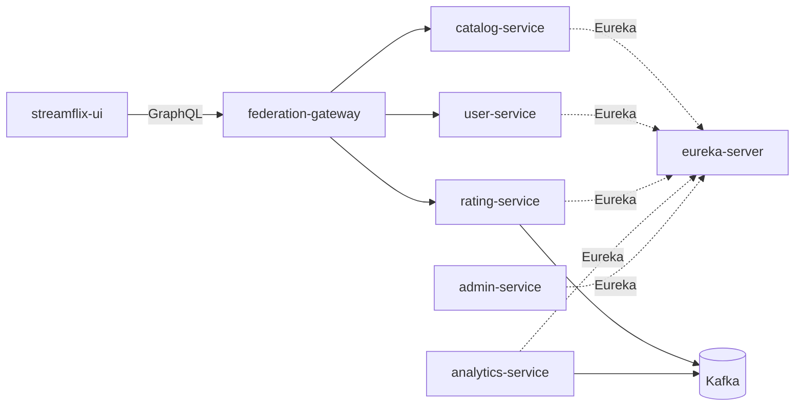

# Streamflix Workspace

A **microservices** demo inspired by streaming platforms: **GraphQL subgraphs** (Netflix DGS) register with **Eureka**, a **Node.js Apollo Federation gateway** composes a single supergraph for the **React** UI, with **Kafka**-driven analytics, **PostgreSQL** / **MongoDB** persistence, **Redis** for analytics and for **catalog** Spring Cache (`moviesCatalog`), and **OpenTelemetry**-based observability: every Java service exports **traces** and **logs** via OTLP to the **OpenTelemetry Collector**, which fans out to **Grafana Tempo** (traces) and **Grafana Loki** (logs). **Prometheus** scrapes JVM and **cAdvisor** container metrics; **Grafana** is the single pane for metrics, traces, and logs (with trace↔log correlation).

---

## Architecture (high level)



_Spring Boot Admin is optional; it only monitors registered apps via Eureka._

**Request flow**

1. The browser talks only to the **federation gateway** (`http://localhost:4000/` by default) for GraphQL.
2. The gateway **introspects** the three subgraphs on a short interval, builds the **supergraph SDL**, and **routes** each field to the correct service.
3. **JWT**: The gateway validates `Authorization: Bearer …` with `JWT_SECRET` (default aligns with user-service). It forwards **`x-user-id`** to subgraphs for authenticated operations. **Refresh** tokens (`typ: refresh`) are ignored for API auth.
4. **Tracing & logs**: `traceparent` / `tracestate` from the client are forwarded to subgraphs. **All Java services** use **`spring-boot-starter-opentelemetry`** and send spans and logs (**OTLP/HTTP**) to the collector (`localhost:4318` from the host when Compose is up). The collector fans out traces to **Grafana Tempo** and logs to **Grafana Loki**. Log records are automatically enriched with `trace_id` / `span_id`, so Grafana can jump from a Tempo span to the matching Loki logs and back.
5. **rating-service** can publish events to **Kafka**; **analytics-service** consumes them and uses **Redis** (see `docker-compose.yml` for local Redis). **catalog-service** uses the same Redis instance (via `REDIS_HOST`) for **Spring Cache** on the `movies` query (`@Cacheable` / `@CacheEvict` on `addMovie`).
6. **Resilience (catalog)**: catalog-service wraps MongoDB **reads** (`movies`, `movie`, federation entity fetch) in a **Resilience4j circuit breaker** (Spring Cloud Circuit Breaker abstraction, instance **`mongoCatalog`**) with safe fallbacks (`movies` → empty list, `movie` → `null`). Writes (`addMovie`) are **not** wrapped. Breaker state is exposed via Actuator health and Micrometer / Prometheus metrics (`resilience4j_circuitbreaker_*`).

---

## Tech stack

| Layer | Technologies |
|--------|----------------|
| **Language / runtime** | Java **25**, **Node.js** (gateway), **React 19** (UI) |
| **Java framework** | **Spring Boot 4.0.x**, **Spring Cloud 2025.1.x** (Netflix Eureka) |
| **GraphQL (Java)** | **Netflix DGS 11** on **Spring GraphQL** (`/graphql`) |
| **GraphQL (gateway)** | **Apollo Server 5**, **Apollo Gateway 2** (federation) |
| **Service discovery** | **Netflix Eureka** |
| **Ops / monitoring (Java)** | **Spring Boot Actuator**, **Prometheus** registry; **all Java services**: **OpenTelemetry** → **OTLP** → **OpenTelemetry Collector** → **Tempo** (traces) + **Loki** (logs) |
| **Resilience (Java)** | **Spring Cloud Circuit Breaker** + **Resilience4j** (**catalog-service** only, instance `mongoCatalog`) |
| **Container metrics** | **cAdvisor** (scraped by Prometheus) |
| **Dashboards** | **Grafana** (provisioned with Prometheus, Tempo, and Loki datasources; trace↔log correlation) |
| **Admin UI** | **Spring Boot Admin 4** (optional `admin-service`) |
| **Databases** | **PostgreSQL 16** (user, rating), **MongoDB 7** (catalog) |
| **Messaging / cache** | **Apache Kafka 3.7** (KRaft), **Redis 7** (analytics + catalog Spring Cache) |
| **Frontend** | **Vite 8**, **Apollo Client 4** |
| **Containers** | **Docker Compose** (infra-only vs full stack) |

---

## Services (detail)

| Service | Port | Role |
|---------|------|------|
| **eureka-server** | 8761 | Eureka registry. Microservices register here; dashboard lists instances. Does not register itself. |
| **catalog-service** | 8081 | DGS **catalog** subgraph. **MongoDB** (`streamflix_db`). Queries `movies` / `movie`; mutation **`addMovie`** (title, optional description/release year). **Spring Cache** on Redis: `movies` is `@Cacheable` (`moviesCatalog`); **`addMovie`** evicts that cache. **Resilience4j circuit breaker** (`mongoCatalog`) wraps Mongo reads inside `MovieCatalogService` via programmatic `Resilience4JCircuitBreakerFactory.create(...).run(...)`; fallbacks return **empty list** (`movies`) or **empty `Optional`** (`movie` / entity fetch). Writes (`addMovie`) are not wrapped. Breaker state is surfaced through Actuator health + Prometheus metrics. **`spring-boot-starter-kafka`** on the classpath (no producer wired in this module yet). **Tracing & logs**: **`spring-boot-starter-opentelemetry`**, OTLP export (see **`OTLP_TRACES_ENDPOINT`** / **`OTLP_LOGS_ENDPOINT`**). **Prometheus** registry via Actuator. GraphQL at `/graphql`. |
| **user-service** | 8082 | DGS **user** subgraph. **PostgreSQL** + JPA. Auth (JWT via `java-jwt`). GraphQL at `/graphql`. |
| **rating-service** | 8083 | DGS **rating** subgraph. **PostgreSQL** + JPA. **Kafka** producer/consumer patterns for ratings-related events. GraphQL at `/graphql`. |
| **analytics-service** | 8084 | **Kafka** consumer, **Redis**, REST/actuator. No DGS in POM—event-driven analytics and health for admin. |
| **admin-service** | 8085 | **Spring Boot Admin** server + Eureka client. UI for actuator endpoints of registered apps (health, metrics, env). |
| **federation-gateway** | 4000 | **Apollo Federation** supergraph. Subgraph URLs via `CATALOG_URL`, `USER_URL`, `RATING_URL` (defaults: `localhost` subgraph ports). |
| **streamflix-ui** | 5173 (dev) | **Vite** dev server; GraphQL target from `VITE_GRAPHQL_URI` (default `http://localhost:4000/`). **Apollo Client** sends `Authorization` and **proactive token refresh** (`Refresh` mutation in `src/lib/authRefresh.js`). Single-page catalog: list movies (title, description, release year, federated ratings), **login**, **add movie** when logged in (`addMovie`; catalog does not enforce `x-user-id`), **rate** when logged in (`addRating`; requires gateway JWT so rating-service receives `x-user-id`). |

**Infrastructure-only containers** (`docker-compose.yml`): PostgreSQL, MongoDB, Redis, RedisInsight (`8001`), Kafka, Kafka UI (`8090`), **OpenTelemetry Collector** (OTLP **4317** gRPC, **4318** HTTP), **Grafana Tempo** (`3200`), **Grafana Loki** (`3100`), **cAdvisor** (`8099`), **Prometheus** (`9090`), **Grafana** (`3005`). Collector config: [`otel-collector/config.yaml`](otel-collector/config.yaml) (forwards traces to Tempo, logs to Loki). Tempo config: [`tempo/tempo.yaml`](tempo/tempo.yaml). Loki config: [`loki/loki-config.yaml`](loki/loki-config.yaml). Grafana datasource provisioning: [`grafana/provisioning/datasources/datasources.yaml`](grafana/provisioning/datasources/datasources.yaml).

---

## Prerequisites

- **JDK 25** and **Maven 3.9+** (for Spring Boot apps)
- **Node.js** (LTS recommended) and **npm** (gateway + UI)
- **Docker Desktop** (or compatible engine) for Compose
- **PowerShell** on Windows (for `scripts/dev-up.ps1`)
- Optional: **[mprocs](https://github.com/pvolok/mprocs)** for running many processes in one TUI

---

## How to run

### Option A — Local development (recommended): infra in Docker, apps on the host

1. **Start infrastructure** (from repo root):

   ```bash
   docker compose up -d --wait
   ```

   This uses `docker-compose.yml`: Postgres, Mongo, Redis, Kafka (+ UIs), OTel collector, Tempo, Loki, cAdvisor, Prometheus, Grafana.

2. **Start Eureka**, then **subgraphs**, then **gateway**, then **UI** (order matters the first time so registration and introspection succeed).

   On Windows, from repo root:

   ```powershell
   .\scripts\dev-up.ps1
   ```

   That script runs `docker compose up -d --wait` then launches **mprocs** (see `mprocs.yaml`). In mprocs, start at least: **eureka** → **catalog**, **user**, **rating**, **analytics** (if needed) → **gateway** → **ui**.

   **Gateway:** from `federation-gateway/`, run `npm install` once, then `node index.js` (or use the **gateway** entry in mprocs).

   **UI:** from `streamflix-ui/`, run `npm install` once, then `npm run dev`.

   Or run Spring Boot manually per folder:

   ```bash
   cd eureka-server && mvn spring-boot:run
   cd catalog-service && mvn spring-boot:run
   # … same for user-service, rating-service, analytics-service, admin-service (optional)
   ```

3. **Environment (local defaults)**  
   Services use `application.yml` defaults such as `localhost` for databases and `localhost:8761` for Eureka. Kafka from the host uses **`localhost:9094`** (see `KAFKA_ADVERTISED_LISTENERS` in `docker-compose.yml`). **Redis:** `docker-compose.yml` exposes Redis on `localhost:6379`; set **`REDIS_HOST=localhost`** for **catalog-service** (cache) and **analytics-service** (default in their `application.yml`).

### Option B — Full stack in Docker

Build and run everything defined in `docker-compose-full.yml` (microservices + gateway + UI image + Eureka; **no** Redis service in that file—use `docker-compose.yml` for Redis if **analytics** or **catalog cache** needs it, or extend the full file):

```bash
docker compose -f docker-compose-full.yml up --build
```

UI is mapped to **http://localhost:3000** (Nginx). Gateway inside the compose network uses service hostnames (`http://catalog-service:8081/graphql`, etc.).

---

## Useful URLs (local dev)

| URL | Purpose |
|-----|---------|
| http://localhost:8761 | Eureka dashboard |
| http://localhost:8085 | Spring Boot Admin (if `admin-service` is running) |
| http://localhost:4000/ | Apollo Federation GraphQL (gateway) |
| http://localhost:5173/ | Streamflix UI (Vite dev; port may vary—check terminal) |
| http://localhost:4318 | OTLP/HTTP ingest (OpenTelemetry Collector; traces `/v1/traces`, logs `/v1/logs`) |
| http://localhost:3200 | Grafana Tempo (trace query API) |
| http://localhost:3100 | Grafana Loki (log query API) |
| http://localhost:8099 | cAdvisor (container metrics UI) |
| http://localhost:9090 | Prometheus |
| http://localhost:3005 | Grafana (Prometheus + Tempo + Loki pre-provisioned) |
| http://localhost:8090 | Kafka UI |
| http://localhost:8001 | RedisInsight |

---

## Important environment variables

| Variable | Used by | Purpose |
|----------|---------|---------|
| `EUREKA_URL` | Java clients | Eureka server URL (default `http://localhost:8761/eureka/`) |
| `MONGO_URI` | catalog-service | Mongo connection string |
| `POSTGRES_URL` | user-service, rating-service | JDBC URL |
| `KAFKA_URL` | rating-service, analytics-service | Broker list (`localhost:9094` from host; `kafka:9092` inside Docker network) |
| `REDIS_HOST` | catalog-service, analytics-service | Redis host (default `localhost`; catalog uses it for `RedisCacheManager`) |
| `SUPERGRAPH_POLL_MS` | federation-gateway | Subgraph introspection interval in ms (default `10000`) |
| `OTLP_TRACES_ENDPOINT` | all Java services | OTLP/HTTP traces endpoint (default `http://localhost:4318/v1/traces`; in `docker-compose-full` use `http://otel-collector:4318/v1/traces`) |
| `OTLP_LOGS_ENDPOINT` | all Java services | OTLP/HTTP logs endpoint (default `http://localhost:4318/v1/logs`; in `docker-compose-full` use `http://otel-collector:4318/v1/logs`) |
| `CATALOG_URL`, `USER_URL`, `RATING_URL` | federation-gateway | Subgraph GraphQL endpoints |
| `JWT_SECRET` | gateway + user-service | Shared secret for JWT (gateway default must match user-service for auth) |
| `VITE_GRAPHQL_URI` | streamflix-ui | Gateway URL for Apollo Client |

---

## Windows / Eureka note

If **Spring Boot Admin** or clients cannot resolve hostnames like `*.mshome.net` from Eureka registrations, prefer stable addresses: set `eureka.instance.prefer-ip-address: true` (and optionally `hostname` / `ip-address`) on **each** registering client so health checks use resolvable hosts.

---

## Repository layout (summary)

```text
streamflix-workspace/
├── admin-service/          # Spring Boot Admin + Eureka client
├── analytics-service/      # Kafka + Redis + Eureka
├── catalog-service/        # DGS + MongoDB + Redis cache + Resilience4j CB + Eureka
├── eureka-server/          # Eureka registry
├── federation-gateway/     # Node Apollo Gateway
├── rating-service/         # DGS + Postgres + Kafka + Eureka
├── user-service/           # DGS + Postgres + Eureka + JWT
├── streamflix-ui/          # React + Vite + Apollo Client
├── scripts/dev-up.ps1      # Docker infra + mprocs
├── otel-collector/         # Collector config (OTLP → Tempo traces, Loki logs)
├── tempo/                  # Tempo config (OTLP receiver, local storage)
├── loki/                   # Loki config (filesystem, single binary)
├── grafana/provisioning/   # Grafana datasources (Prometheus, Tempo, Loki)
├── prometheus.yml          # Prometheus scrape config (JVM + cAdvisor)
├── docker-compose.yml      # Dev infrastructure + OTel collector + Tempo + Loki + cAdvisor + Prometheus/Grafana + Kafka/Redis UIs
├── docker-compose-full.yml # Optional: all services containerized
└── mprocs.yaml             # Multi-process dev layout
```

---

## License

See individual modules / team policy; not specified in this README.
